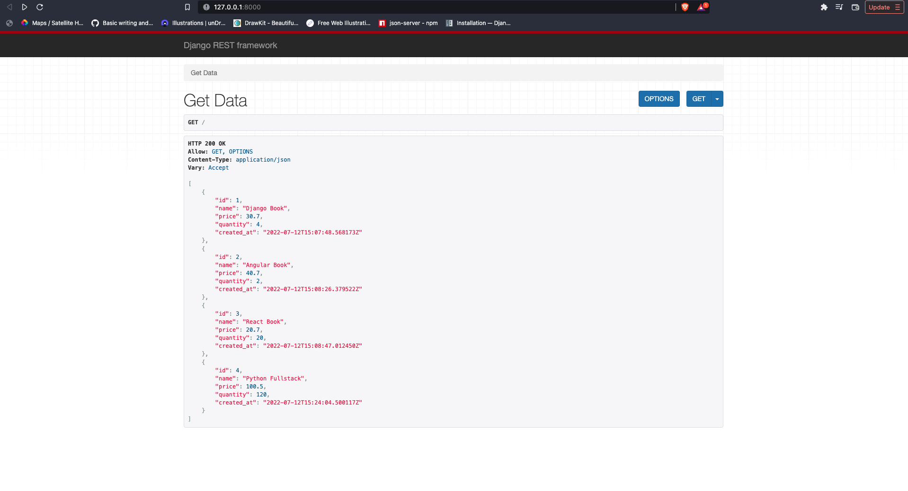
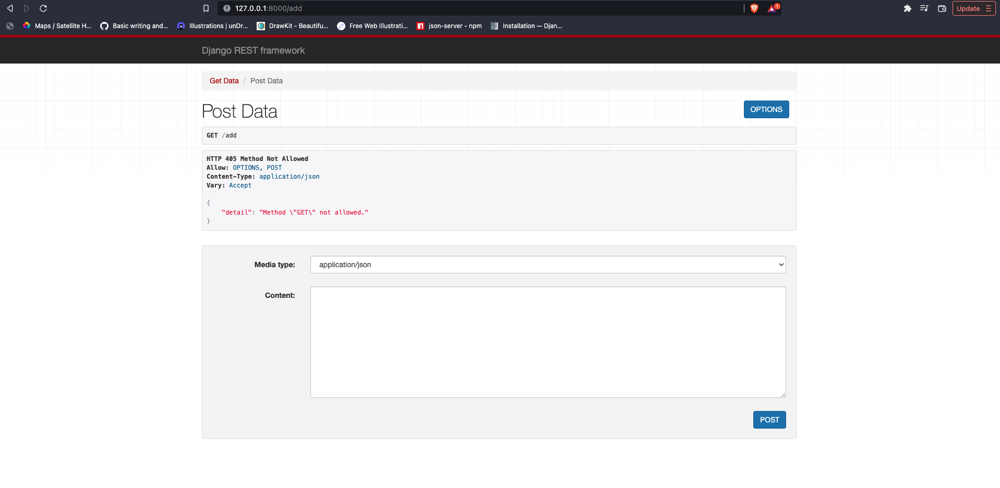

# Django-Rest-Framework

### GET data



```
from django.shortcuts import render
from rest_framework.response import Response
from rest_framework.decorators import api_view
from .models import Item
from .serializers import ItemSerializer


# Create your views here.

@api_view(['GET'])
def getData(request):
    items= Item.objects.all()
    serializer = ItemSerializer(items, many=True)
    return Response(serializer.data)

```

### POST data



```
@api_view(['POST'])
def postData(request):
    serializer = ItemSerializer(data=request.data)
    if serializer.is_valid():
        serializer.save()
        return Response(serializer.data)
    return Response(serializer.errors)
```

### Serializer.py

```
from rest_framework import serializers
from .models import Item

class ItemSerializer(serializers.ModelSerializer):
    class Meta:
        model = Item
        fields = '__all__'

```

### models.py

```
from enum import auto
from venv import create
from django.db import models

# Create your models here.
class Item(models.Model):
    name = models.CharField(max_length=200)
    price = models.FloatField()
    quantity = models.IntegerField()
    created_at = models.DateTimeField(auto_now_add=True)

    def __str__(self):
        return self.name
```
